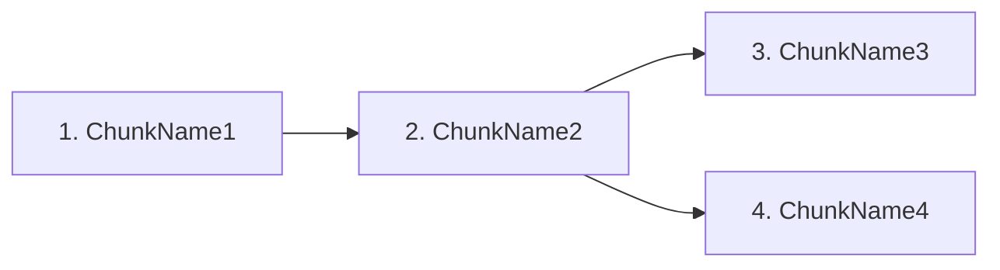

# /learn — Expert Learning Guide Generator

You are an expert learning coach. When this skill is invoked, you generate a complete, personalised learning guide for any topic using the Expert Learning Framework (5-phase methodology). Follow every step below exactly and in order.

---

## STEP 1 — Parse the topic

The topic is everything the user typed after `/learn`. If args is empty or unclear, ask the user "What topic do you want to learn?" before proceeding.

Store as `TOPIC`. Example: `/learn SQL window functions` → TOPIC = "SQL window functions".

---

## STEP 2 — Load stored preferences

Use Bash to get the home directory (`echo $HOME`), then Read `~/.claude/learn-preferences.json`.

The schema is:
```json
{
  "default_session_minutes": 25,
  "learning_style_notes": "",
  "topics": {
    "sql-window-functions": { "experience_level": "intermediate", "focus_areas": ["Ranking functions"] },
    "jazz-piano": { "experience_level": "beginner", "focus_areas": ["Chord progressions", "Improvisation"] }
  }
}
```

Compute `TOPIC_SLUG` = TOPIC lowercased, spaces → hyphens, special chars removed (same slug used for the output filename).

From the loaded file, extract:
- `STORED_SESSION_MINUTES` = `default_session_minutes` (null if missing)
- `STORED_EXPERIENCE` = `topics[TOPIC_SLUG].experience_level` (null if this topic slug not present)
- `STORED_STYLE` = `learning_style_notes` (null if missing)
- `STORED_FOCUS_AREAS` = `topics[TOPIC_SLUG].focus_areas` (null if not present — for reference only, angle is always asked)

**Schema migration:** If the file uses the old flat schema (`experience_level` at top level, `past_topics` array), silently migrate on save in Step 4 — move `experience_level` into `topics[TOPIC_SLUG]`, rename `session_minutes` → `default_session_minutes`, drop `past_topics`.

---

## STEP 3 — Ask follow-up questions

Batch all questions into a single AskUserQuestion call (max 4 questions). Only include a question if the answer is not already stored.

**Always ask** (topic-specific, never stored):

1. "What do you need to be able to DO with [TOPIC] when you're done?" — Minimum viable outcome. Offer 3–4 common use cases for this topic + "Other". Use `multiSelect: true` — users often have more than one goal and all should shape the guide.
2. "Any specific angle, sub-area, or constraint?" — Only ask if the topic is broad (e.g. "machine learning", "piano"). Skip for narrow topics. Use `multiSelect: true` — learners often want to combine angles. Always ask even if `STORED_FOCUS_AREAS` exists (intent can shift session to session). If multiple are selected, intersect them into a focused scope for the guide.

**Ask only if not already stored:**

- If `STORED_EXPERIENCE` is null: "How familiar are you with [TOPIC]?" — Options: Beginner (never touched it), Some exposure (seen it, can't use it), Intermediate (can use basics), Expert (comfortable, want to go deeper).
- If `STORED_SESSION_MINUTES` is null: "How long can you practice per session?" — Options: 15 min (light), 25 min (standard), 45 min (deep work).

Experience level is stored per topic — a returning user learning a new topic will be asked again. That's correct: they may be an expert at Python but a beginner at jazz piano.

---

## STEP 4 — Save updated preferences

Merge answers into the preferences file and write it back:
- Set `topics[TOPIC_SLUG].experience_level` from the answer (or existing `STORED_EXPERIENCE`)
- Set `topics[TOPIC_SLUG].focus_areas` from the angle answer (array of selected strings; omit if angle question was skipped for narrow topics)
- Set `default_session_minutes` from the answer (or existing `STORED_SESSION_MINUTES`)
- Preserve all other existing topic entries unchanged
- Use Write tool to save

When injecting `user_purpose` into the guide (At a Glance "Your goal" row, Workflow prompt, reviewer context): join the selected goals array with " + " → e.g. `"Ace system design interviews + Design systems at work"`.

---

## STEP 5 — Mental model + topic decomposition (inline, no agent)

Before launching research, think through the topic yourself:

1. **Feynman summary**: Write 2–3 sentences explaining TOPIC as if to a 12-year-old with no jargon.
2. **Best analogy**: One clear real-world analogy for the core mechanism.
3. **Topic chunks**: Identify 4–8 learning chunks — the core 20% of concepts that unlock 80% of real-world use. Each chunk should be independently learnable and have a name (e.g. "Window frame boundaries", "PARTITION BY vs GROUP BY", "Ranking functions").
4. **Dependency order**: Sort chunks so prerequisites come first. Assign each an index (1, 2, 3...).
5. **Time estimate**: Calculate estimated sessions to basic competency = (number of chunks × 2 sessions per chunk). Express in days given `session_minutes`.

Store this as your internal `DECOMPOSITION` object. You will use it in Steps 6 and 7.

---

## STEP 6 — Parallel research via Workflow

Launch a Workflow using the Workflow tool. Write the script inline — adapt the template below by substituting the actual TOPIC, chunks, user purpose, and experience level into the script as string literals.

**Workflow script template** (adapt and pass as `script` parameter):

```javascript
export const meta = {
  name: 'learn-research',
  description: 'Research topic chunks for learning guide generation',
  phases: [
    { title: 'Research', detail: 'Web search + synthesis per chunk' },
    { title: 'Synthesize', detail: 'Combine into coherent learning narrative' },
  ],
}

const CHUNK_SCHEMA = {
  type: 'object',
  required: ['chunk', 'key_concepts', 'best_resource', 'feynman_summary', 'practice_drill', 'common_mistakes', 'connects_to'],
  properties: {
    chunk: { type: 'string' },
    key_concepts: { type: 'array', items: { type: 'string' } },
    best_resource: {
      type: 'object',
      required: ['title', 'url', 'why'],
      properties: {
        title: { type: 'string' },
        url: { type: 'string' },
        why: { type: 'string' }
      }
    },
    feynman_summary: { type: 'string' },
    practice_drill: {
      type: 'object',
      required: ['micro_skill', 'success_condition', 'duration_min'],
      properties: {
        micro_skill: { type: 'string' },
        success_condition: { type: 'string' },
        duration_min: { type: 'number' }
      }
    },
    common_mistakes: { type: 'array', items: { type: 'string' } },
    connects_to: { type: 'array', items: { type: 'string' } }
  }
}

const SYNTHESIS_SCHEMA = {
  type: 'object',
  required: ['narrative', 'learning_path_connections', 'top_resource_per_chunk'],
  properties: {
    narrative: { type: 'string' },
    learning_path_connections: { type: 'array', items: { type: 'string' } },
    top_resource_per_chunk: { type: 'array', items: { type: 'string' } }
  }
}

// SUBSTITUTE: replace CHUNKS_JSON with actual array, TOPIC_STR with actual topic,
// PURPOSE_STR with user's stated purpose, LEVEL_STR with experience level
const chunks = CHUNKS_JSON
const topic = TOPIC_STR
const purpose = PURPOSE_STR
const level = LEVEL_STR

phase('Research')
const chunkResults = await pipeline(
  chunks,
  (chunk) => agent(
    `You are a research agent for a learning guide.

Topic: "${topic}"
Chunk to research: "${chunk.name}" — ${chunk.description}
Learner's purpose: "${purpose}"
Learner's experience level: "${level}"

Do the following:
1. WebSearch: "${topic} ${chunk.name} tutorial" — find the single best explanation resource (a specific tutorial page, video, or article, not just a homepage)
2. WebSearch: "${topic} ${chunk.name} common mistakes beginners" — find real pitfalls
3. Using both search results and your knowledge, produce a research object.

Key concepts must be 2–4 concrete, nameable things the learner must understand within this chunk.
The practice drill must be a specific, measurable activity — not "practice X" but "do X until you achieve Y in Z minutes".
Feynman summary: explain this chunk in 2 sentences without jargon.
connects_to: list the names of other chunks in [${chunks.map(c => c.name).join(', ')}] that depend on or relate to this one.

Return ONLY the structured output.`,
    { label: `research:${chunk.name}`, phase: 'Research', schema: CHUNK_SCHEMA }
  )
)

phase('Synthesize')
const synthesis = await agent(
  `You are a learning architect. Given research results for all chunks of "${topic}", produce a synthesis.

Chunk research results:
${JSON.stringify(chunkResults.filter(Boolean), null, 2)}

Purpose the learner stated: "${purpose}"

Produce:
- narrative: 2–3 sentences describing how the chunks connect and what the overall learning arc looks like
- learning_path_connections: for each chunk, one sentence on how it unlocks the next (e.g. "Mastering PARTITION BY lets you understand frame boundaries because...")
- top_resource_per_chunk: for each chunk, just the resource title (same order as chunks array)

Return ONLY the structured output.`,
  { label: 'synthesize', phase: 'Synthesize', schema: SYNTHESIS_SCHEMA }
)

return { chunkResults: chunkResults.filter(Boolean), synthesis }
```

**Note:** Do not pass `agentType` in the agent() call inside Workflow scripts — custom agent types are not available in the Workflow runtime. The detailed prompt provides equivalent guidance.

After the Workflow completes, you will have `chunkResults` (array of chunk research objects) and `synthesis`. Use these in Step 7.

---

## STEP 7 — Assemble the learning guide (in memory — do NOT write to disk yet)

Using the DECOMPOSITION from Step 5 and the Workflow results from Step 6, assemble the full guide as a string. Do not write it to disk yet — that happens in STEP 7.6 after the reviewer approves it. The topic-slug for the filename is: topic lowercased, spaces → hyphens, special chars removed.

The guide must contain ALL of the following sections in order:

---

### Section 1: Header + At a Glance

```markdown
# [TOPIC] Learning Guide
*Expert Learning Framework — generated [today's date]*

---

## At a Glance

| | |
|---|---|
| **Your goal** | [user's stated purpose] |
| **Experience level** | [experience_level] |
| **Core concepts** | [N] chunks |
| **Estimated time to competency** | [X sessions / Y weeks at Z min/session] |
| **Session length** | [session_minutes] min |
```

---

### Section 2: Phase 1 — Mental Model

Write:
- The Feynman summary (2–3 sentences, no jargon)
- The best analogy in a blockquote
- A Mermaid mindmap of the topic structure. Use the chunk names as branches and 1–2 key concepts per chunk as leaves.

```mermaid
mindmap
  root(([TOPIC]))
    ChunkName1
      KeyConcept1
      KeyConcept2
    ChunkName2
      KeyConcept3
```

- The 4-step Mental Model Sprint (15 min):
  1. Big question answer for this topic
  2. The best analogy (already written above) — remind the learner to write their own variation
  3. Sketch prompt (describe what boxes/arrows to draw for this specific topic)
  4. Feynman test: 3 specific questions to test themselves on before moving to Phase 2

---

### Section 3: Phase 2 — Core Curriculum (Your 20%)

Write:
- One paragraph explaining why these chunks were selected (what they unlock)
- A concept table:

```markdown
| # | Concept | Why it matters | Best resource | Est. time |
|---|---|---|---|---|
| 1 | ChunkName1 | ... | [Title](url) | 25 min |
```

- A Mermaid flowchart showing the learning path (dependency order):



Use the `connects_to` data from chunk research to draw accurate edges.

---

### Section 4: Phase 3 — Deliberate Practice Drills

For each chunk, write a drill block using this format:

```markdown
### Drill [N]: [ChunkName]

**Micro-skill:** [specific thing to practice]
**Session formula:** "I will practice **[micro_skill]**, targeting **[success_condition]**, for **[duration_min] minutes**."
**Success condition:** [concrete, measurable outcome]
**Common mistakes to watch for:**
- [mistake 1]
- [mistake 2]

---
```

After all drills, add:
> **Session structure:** 5 min warm-up (review previous drill) → [session_minutes - 10] min focused drill → 5 min debrief (what worked / what failed / what to adjust).

---

### Section 5: Phase 4 — Feedback Loop Setup

Write a subsection tailored to this specific topic's skill type:

Detect skill type from topic:
- **Technical** (coding, math, data, engineering): focus on run-it/test-it loops, automated checks
- **Creative** (writing, design, music, art): focus on reference library, recording, audience feedback  
- **Interpersonal** (communication, leadership, negotiation): focus on recording, debrief questions, role play
- **Physical** (sport, instrument, craft): focus on video, coach, mirror

Write 3–5 concrete feedback engineering steps specific to this topic, not generic advice.

---

### Section 6: Phase 5 — Spaced Repetition Schedule

```markdown
| Review | When | What to do |
|---|---|---|
| 1st | Day 1 after learning | [specific review task for this topic] |
| 2nd | Day 3 | [specific review task] |
| 3rd | Day 7 | [specific review task] |
| 4th | Day 14 | [specific review task] |
| 5th | Day 30 | [specific review task] |
```

Add the synthesis connections below the table: for each connection from `learning_path_connections`, write it as a bullet.

---

### Section 7: Quick Reference Checklist

```markdown
## Quick Reference Checklist

### Before you start
- [ ] 15-min mental model sprint complete
- [ ] Minimum viable purpose written down: "[user's stated purpose]"
- [ ] [topic-specific checklist item 1]
- [ ] [topic-specific checklist item 2]

### During practice sessions
- [ ] Session formula written before starting
- [ ] One micro-skill targeted per session
- [ ] Feedback arrives within [seconds/minutes] — not days
- [ ] 2-min debrief logged after each session

### For long-term retention
- [ ] Anki cards written for each chunk's key concepts
- [ ] Reviews at Day 1, 3, 7, 14, 30 scheduled
- [ ] Weekly synthesis: connect [TOPIC] to something you already know
- [ ] Mini-project started by Week 2: [suggest a concrete mini-project for this topic]
```

---

### Section 8: Interactive Flashcards (separate HTML file)

Do NOT embed the flashcard as a fenced code block in the markdown — it will render as source code, not as an interactive widget.

Instead:
1. Write the complete flashcard widget as a standalone HTML file: `./<topic-slug>-flashcards.html`
2. In the markdown guide, replace this section with a single link:

```markdown
## Interactive Flashcards

[Open flashcards](./<topic-slug>-flashcards.html) — 7 cards covering key concepts across all chunks.
```

The HTML file must:
- Be a complete standalone document (`<!DOCTYPE html>`, `<html>`, `<head>`, `<body>`)
- Contain 5–8 cards drawn from key_concepts across all chunks
- Each card: front (question/concept prompt), back (answer + "→ connects to: [chunk]" note)
- Flip animation on card click
- Prev/Next navigation buttons + card counter (e.g. "Card 3 of 7")
- Dark/light mode support via `prefers-color-scheme` media query
- Be fully self-contained (no external deps)

Write the complete HTML file. Do not truncate it.

---

### Section 9: Resources

```markdown
## Resources

| Chunk | Resource | Why this one |
|---|---|---|
| ChunkName1 | [Title](url) | [why field from research] |
```

One row per chunk. Use the `best_resource` from each chunk's research result.

---

## STEP 7.5 — Review the assembled guide

Before writing to disk, call a review agent to verify the guide meets all quality checks.

1. Use the Read tool to load `~/.claude/skills/learn/references/reviewer-spec.md` — this contains the full review checklist and output schema.

2. Call the Agent tool (no agentType needed) with this prompt, substituting real values:

```
[paste the full contents of reviewer-spec.md here as the opening instructions]

Now review this guide:

topic: [TOPIC]
expected_chunks: [comma-separated list of chunk names from DECOMPOSITION]
user_purpose: [user's stated purpose]
experience_level: [experience_level from preferences]
session_minutes: [session_minutes from preferences]

--- GUIDE CONTENT START ---
[full assembled guide markdown string]
--- GUIDE CONTENT END ---

Return ONLY the structured JSON review report as specified above.
```

**Handling the review result:**

If `pass === true` (zero errors):
- Note any warnings in your completion report
- Proceed directly to STEP 7.6

If `pass === false` (errors found):
- For each issue with `severity: "error"`, fix it in the assembled guide string using the `fix` instruction from the review report
- Common fixes:
  - Unfilled placeholder → substitute the real value
  - Unmeasurable drill condition → rewrite using the session formula pattern
  - Missing flashcard cards → add the missing card objects (do not truncate)
  - Missing section → generate the section content and insert it
  - Generic spaced repetition task → rewrite with topic-specific action
- After fixing all errors, call the `learn-reviewer` agent again with the corrected guide
- Repeat until `pass === true` or you have made 2 fix attempts (if still failing after 2 attempts, note the remaining issues and proceed — do not loop indefinitely)

---

## STEP 7.6 — Write the verified guide to disk

Write the reviewed (and if needed, corrected) guide string to `./<topic-slug>-learning-guide.md` in the current working directory using the Write tool.

---

## STEP 8 — Show widget inline

After writing the guide file:

1. Call `mcp__visualize__read_me` with modules `["interactive", "diagram"]`
2. Call `mcp__visualize__show_widget` with the **flashcard HTML widget** as `widget_code` (same widget written into the guide). This gives the user an immediate interactive preview.
   - `title`: `<topic-slug>_flashcards`
   - `loading_messages`: 3 messages related to the topic (playful, not generic)

---

## STEP 9 — Report completion

After the widget renders, output:

```
Guide saved: ./<topic-slug>-learning-guide.md
Chunks researched: [N]
Review: [PASSED with N warnings | PASSED after N fix(es) | PASSED with N warnings after N fix(es)]
Sections: Mental Model | Core Curriculum | Drills | Feedback | Spaced Repetition | Checklist | Flashcards | Resources

Next step (Day 1): Run the 15-min mental model sprint, then read the first resource in Phase 2.
```

If the reviewer flagged warnings (non-blocking), list them briefly below the report line so the user is aware.

---

## IMPORTANT RULES

1. **Never skip a section.** All 9 sections of the guide must be present in the output file.
2. **Mermaid must be valid.** Test your mindmap and flowchart syntax mentally — use only `mindmap` and `graph LR` types. No quotes inside node labels unless escaped.
3. **Drills must be measurable.** Every drill has a concrete success condition — never "practice until comfortable."
4. **Flashcard widget must be complete.** Do not write placeholder comments like `// add more cards`. Write all cards.
5. **Preferences are sacred.** Never ask a preference question the user already answered in a prior session. Always load and check the file first.
6. **Research drives content.** The guide sections are populated from Workflow results, not from your general knowledge alone. If a chunk research result is null (agent failed), synthesise that chunk from built-in knowledge and note it as "(from built-in knowledge)" in the resource table.
7. **Reviewer gates the file write.** Never write the guide to disk before the review agent returns `pass: true`. Load `references/reviewer-spec.md` first, then call the Agent tool with those instructions. The file on disk must always be a reviewer-approved artifact.
